# Study 1: Corpus Characterisation of LLM Reasoning on Visual Inductive Tasks

**Corpus:** 320 reasoning traces (73,383 sentences) from DeepSeek-R1-Distill-Llama-8B on 4 Zendo visual inductive reasoning tasks.
**Coding:** Single integrated taxonomy (9 micro-labels, 5 macro-labels) applied by Claude Sonnet 4 via Anthropic Batch API, validated against 7 expert-coded traces.

---

## 1. Corpus Overview

The corpus comprises 320 reasoning traces with a total of 73,383 coded sentences. Of these, 163 traces (50.9%) reached a final answer (completed) and 157 (49.1%) were truncated before producing an answer. The corpus is balanced across 4 tasks (80 traces each) and 2 stimulus sets (A and B, 160 traces each).

The coding taxonomy assigns one of 9 micro-labels to each sentence: ORIENT, DESCRIBE, SYNTHESIZE, HYPO, TEST, JUDGE, PLAN, MONITOR, and RULE. These nest within 5 macro-labels: SETUP, OBSERVE, INVESTIGATE, REGULATE, and CONCLUDE. Additional metadata flags capture test context (post_hypothesis, pre_hypothesis, post_rule), specificity (within_panel, across_panels), judgement polarity (accept, reject, uncertain), and confidence (high, medium).

---

## 2. Coding Quality and Reliability

### 2a. Coverage

All quality checks pass at 100%: every sentence has a valid micro-label, macro-label (matching MACRO_MAP), and applicable metadata flags. No sentences outside the appropriate categories carry TEST-specific or JUDGE-specific flags.

| check                       | value   |   n_issues |
|:----------------------------|:--------|-----------:|
| micro_label_valid_pct       | 100.00% |          0 |
| macro_label_valid_pct       | 100.00% |          0 |
| macro_micro_mismatch        | 0       |          0 |
| test_context_valid_pct      | 100.0%  |          1 |
| specificity_valid_pct       | 100.0%  |          0 |
| judgement_valid_pct         | 100.0%  |          0 |
| confidence_valid_pct        | 100.0%  |          0 |
| non_test_has_test_flags     | 0       |          0 |
| non_judge_has_judgement     | 0       |          0 |
| orient_in_first5_pct        | 100.0%  |          0 |
| rule_in_completed_pct       | 96.3%   |          6 |
| traces_with_10plus_run      | 209     |        209 |
| traces_with_70pct_dominance | 1       |          1 |

### 2b. Validation Agreement

Seven traces were independently coded by the researcher and used as ground truth for validation. Mean Cohen's kappa across these traces was **0.829** at the micro-label level and **0.830** at the macro-label level.

Per-category one-vs-rest kappa was computed for each of the 9 micro-labels. Eight of nine categories passed the >=0.50 reliability gate: ORIENT, DESCRIBE, HYPO, TEST, JUDGE, PLAN, MONITOR, and RULE. **SYNTHESIZE** was the only category failing the gate, with a mean one-vs-rest kappa of 0.337. This reflects the inherent difficulty of distinguishing SYNTHESIZE (aggregation without targeting a specific feature) from DESCRIBE (raw readout) and TEST (feature-directed evidence gathering).

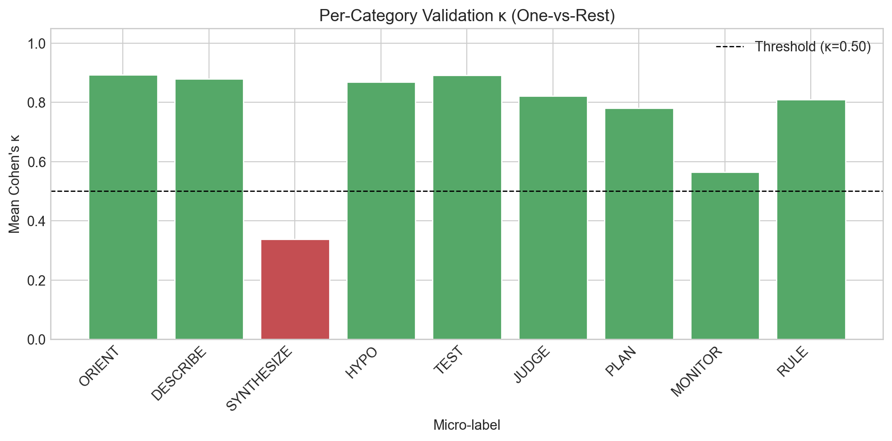

### 2c. Confusion Patterns

The aggregated confusion matrix across all 7 validation traces shows that the primary confusions are between adjacent categories in the OBSERVE-INVESTIGATE boundary: SYNTHESIZE is confused with both DESCRIBE and TEST, and TEST shows minor confusion with JUDGE at the panel-level/hypothesis-level verdict boundary.

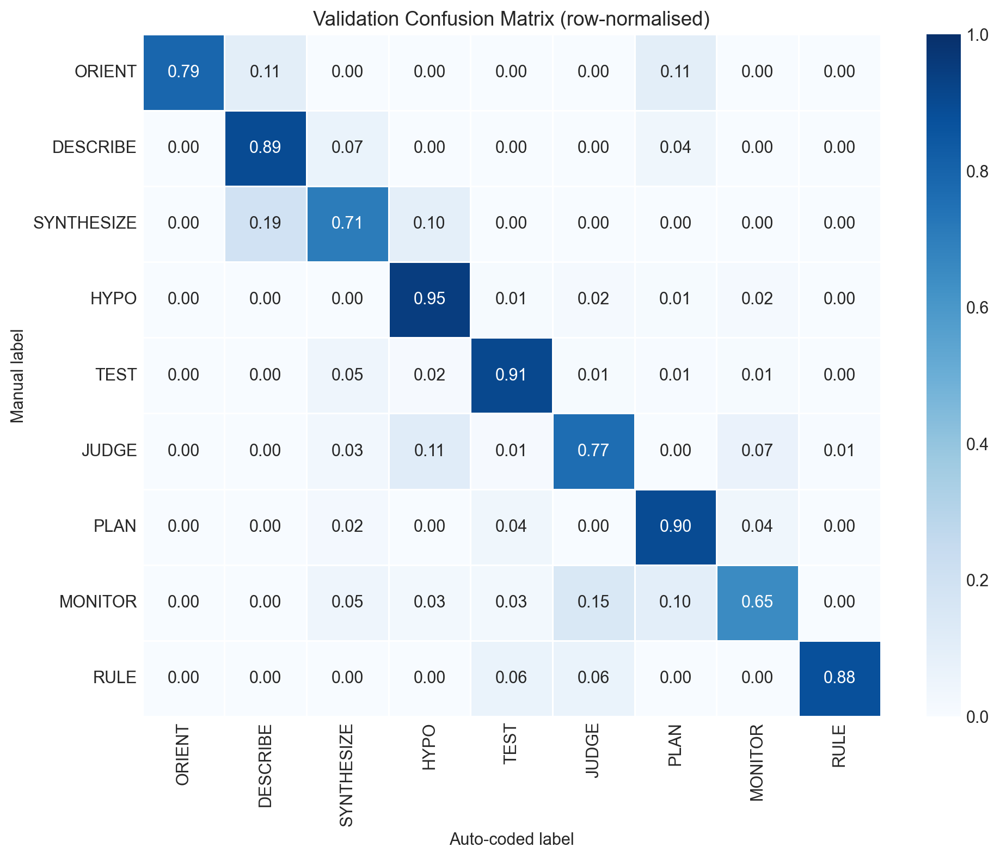

---

## 3. Reasoning Profile

### 3a. Label Distribution

The overall label distribution reveals a corpus dominated by hypothesis-testing activity:
- **ORIENT** (SETUP): 1.0%
- **DESCRIBE** (OBSERVE): 8.4%
- **SYNTHESIZE** (OBSERVE): 3.9%
- **HYPO** (INVESTIGATE): 17.5%
- **TEST** (INVESTIGATE): 50.2%
- **JUDGE** (INVESTIGATE): 12.3%
- **PLAN** (REGULATE): 4.0%
- **MONITOR** (REGULATE): 2.3%
- **RULE** (CONCLUDE): 0.5%

TEST accounts for 50.2% of all sentences, reflecting the extensive evidence extraction required for visual inductive reasoning. The INVESTIGATE macro-category (HYPO + TEST + JUDGE) collectively accounts for 80.0% of the corpus. RULE sentences are rare (0.45%), appearing primarily at trace endings.

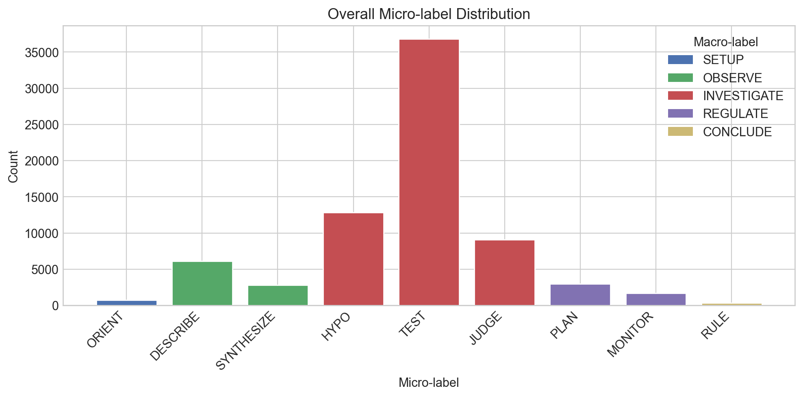

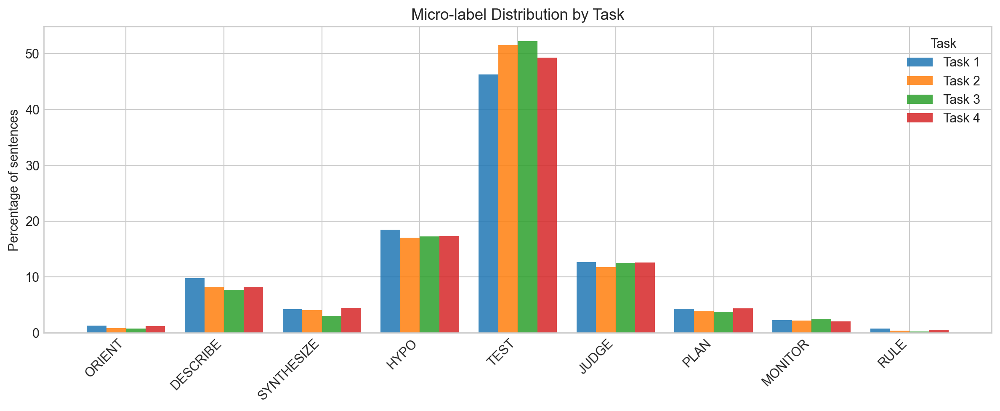

### 3b. Distribution by Task and Set

Label proportions are broadly consistent across the four tasks, with TEST dominating in all cases. Minor task-level variation exists: Task 3 (conjunctive rules) shows slightly higher TEST and lower DESCRIBE proportions, consistent with its more complex rule structure requiring more hypothesis-driven evidence extraction relative to open scanning.

The two stimulus sets (A and B) show comparable distributions, confirming that the coding is not driven by stimulus-specific features.

Completed traces show a higher proportion of RULE (by definition) and slightly higher JUDGE, while truncated traces have proportionally more TEST and HYPO, reflecting the mid-cycle termination.

### 3c. Domain Comparison to Bogdan et al.

Using a post-hoc mapping (Decision 24) from our integrated taxonomy to Bogdan et al.'s category scheme, we compared the Zendo reasoning profile to their math problem-solving baseline. Bogdan's `uncertainty_management` and `self_checking` categories are merged into a single comparison bar because our MONITOR category absorbs both functions (see Decision 24).

The most striking contrast is in **active_computation** (mapped from TEST): Zendo traces devote 50.2% to evidence extraction vs 32.7% for math. This reflects the visual inductive reasoning domain, where the model must systematically check features across multiple panels. Conversely, **fact_retrieval** (mapped from DESCRIBE) is lower in Zendo (8.4% vs 20.1%), since visual scanning is more interleaved with hypothesis testing than factual recall in math.

**plan_generation** (HYPO + PLAN) is higher in Zendo (21.5% vs 15.5%), reflecting the centrality of hypothesis generation to the Zendo task structure. **uncertainty_mgmt + self_checking** is comparable across domains (13.6% vs 18.5%).

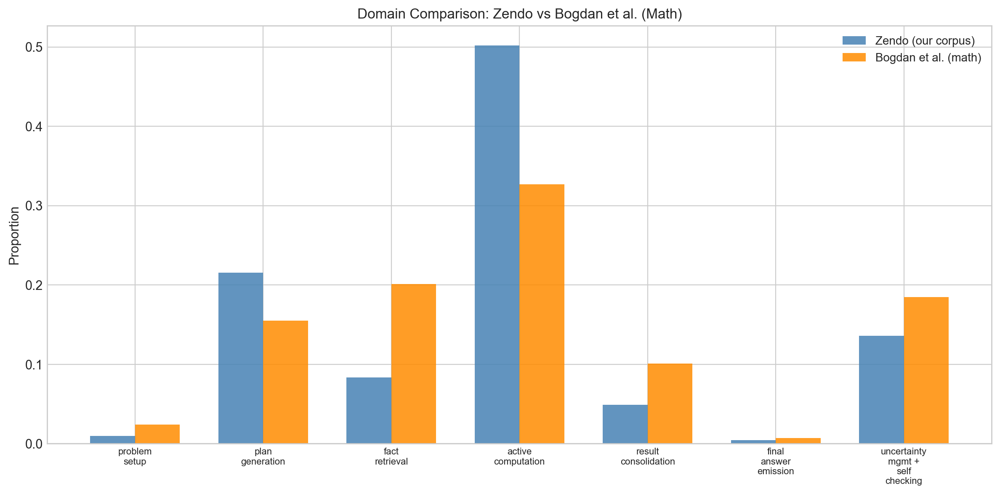

---

## 4. Sequential Structure

### 4a. Transition Probabilities

The 9x9 bigram transition matrix reveals structured sequential patterns. The top 5 transitions by count are:

| From | To | Count | P(next \| current) |
|------|-----|-------|-------------------|
| TEST | TEST | 25,437 | 0.692 |
| HYPO | TEST | 8,032 | 0.628 |
| TEST | JUDGE | 6,316 | 0.172 |
| JUDGE | HYPO | 5,970 | 0.662 |
| DESCRIBE | DESCRIBE | 4,454 | 0.726 |

The dominant **HYPO->TEST->JUDGE->HYPO** cycle is clearly visible: hypotheses lead to evidence testing (P=0.628), testing leads to judgement (P=0.172) or more testing (P=0.692), and judgement leads back to a new hypothesis (P=0.662).

Self-transition rates vary substantially: TEST (0.692) and DESCRIBE (0.726) show high self-transition, reflecting extended runs of evidence extraction and panel scanning. JUDGE has low self-transition (0.092), consistent with its role as a punctual verdict rather than an extended activity.

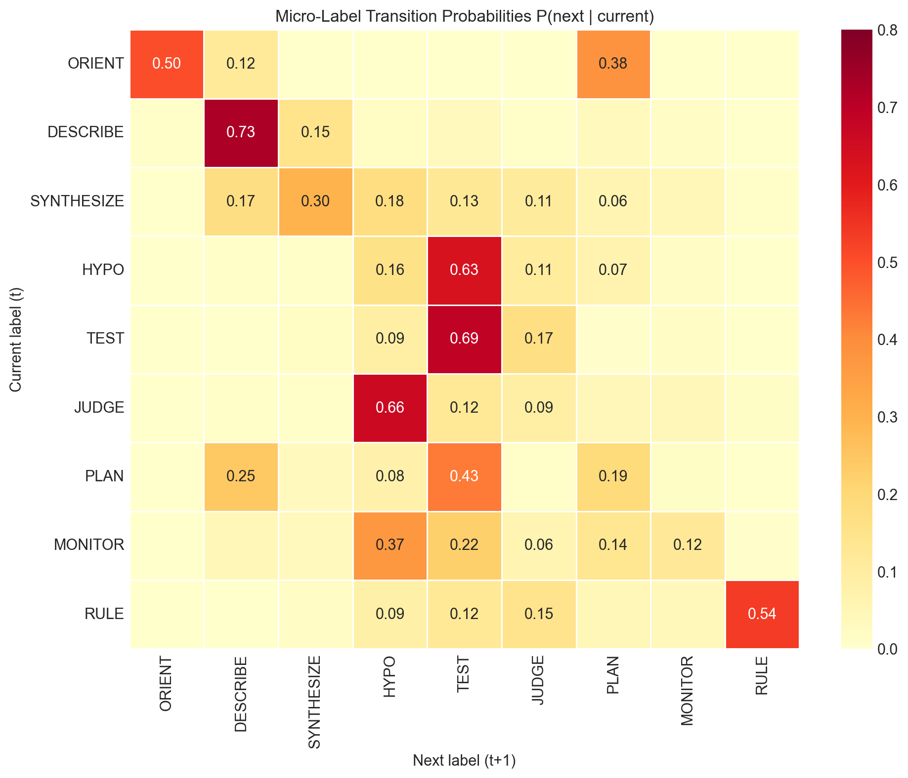

### 4b. Transition Entropy

Per-trace transition entropy (Shannon entropy of bigram distribution) measures the diversity of sequential reasoning patterns. Overall mean entropy is **3.456 bits** (SD = 0.428).

Entropy varies significantly by task (Kruskal-Wallis H = 10.738, p = 0.013), with Task 1 showing the highest entropy (M = 3.560) and Task 3 the lowest (M = 3.376). This suggests that conjunctive rules (Task 3) elicit more stereotyped reasoning patterns.

Completed traces show significantly higher transition entropy than truncated traces (M = 3.571 vs 3.337; Mann-Whitney U = 16,902.5, p < 0.001). This indicates that successful reasoning involves more diverse sequential patterns, while truncated traces show more repetitive cycling.

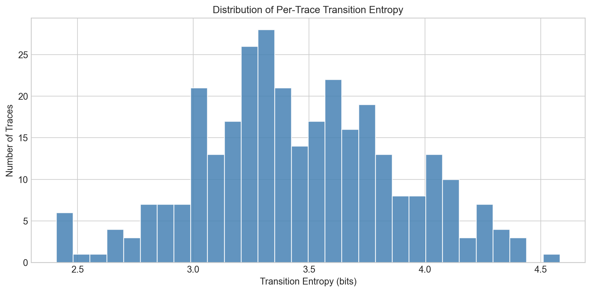

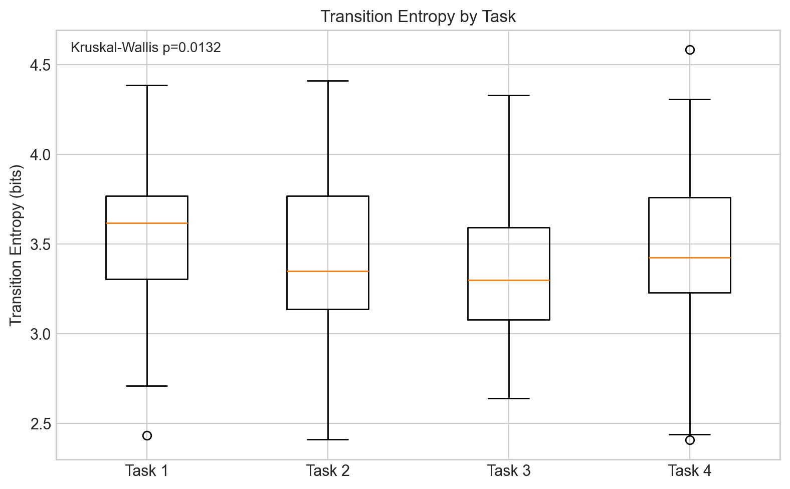

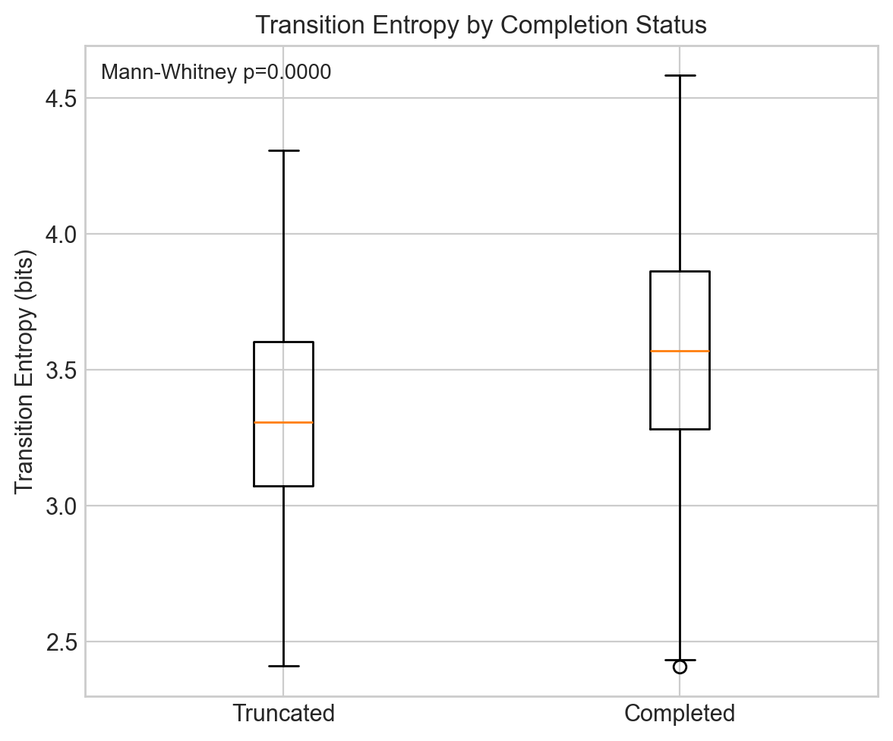

### 4c. Sequence Characteristics

All 320 traces open with **ORIENT**, confirming that the model consistently begins by restating the task. Closing labels differ sharply by completion status: 144 traces (45.0%) end with RULE, followed by 80 ending with TEST.

The first HYPO sentence appears at a mean normalised position of **0.177** (median 0.099), with 317/320 traces containing at least one HYPO. The early median indicates that most traces transition quickly from scanning to hypothesis testing.

**Phase structure:** Traces decompose into three phases: scanning (before first HYPO), cycling (first HYPO to last JUDGE), and convergence (after last JUDGE). On average, scanning occupies 18.3% of the trace, cycling 79.2%, and convergence 2.5%. The cycling phase dominates, reflecting the iterative nature of hypothesis-testing reasoning. Completed traces show more scanning (27.3%) and convergence (3.1%) than truncated traces (9.0% and 1.9%), which are almost entirely in the cycling phase (89.1%).

**Reasoning strategies:** The corpus exhibits three distinct reasoning strategies: full_cycling (303 traces) with the standard HYPO->TEST->JUDGE pattern, scan_test_conclude (14 traces) where hypotheses are proposed but never formally judged, and direct_insight (3 traces) where the model reaches a conclusion without explicit hypothesis generation. The 17 non-cycling traces all completed successfully, representing alternative reasoning pathways rather than failures.

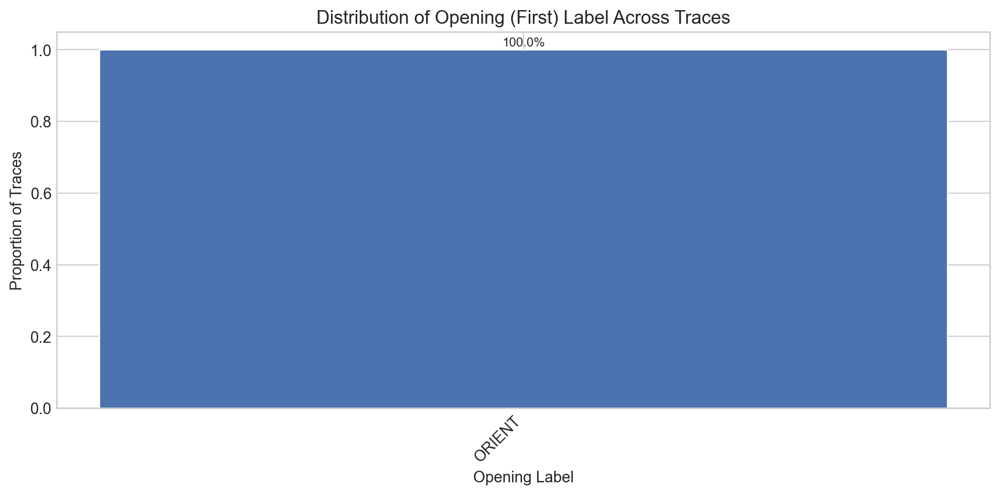

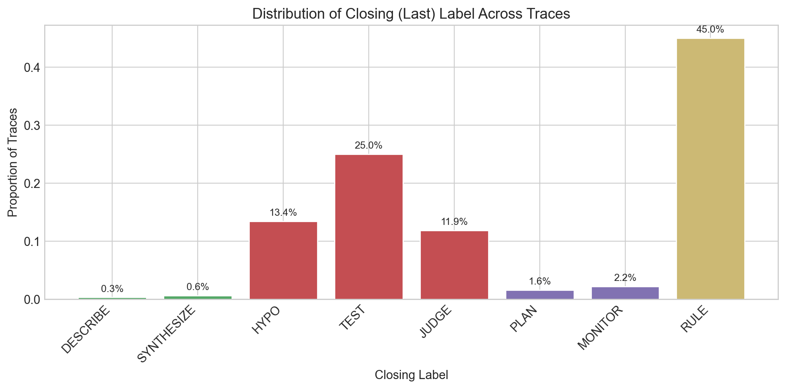

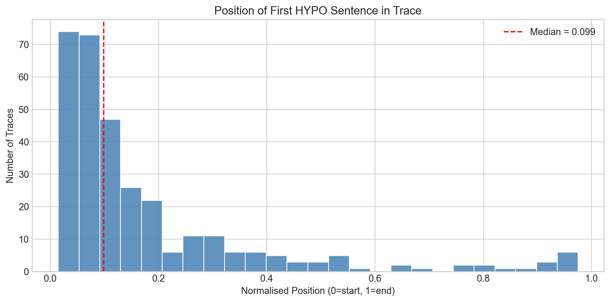

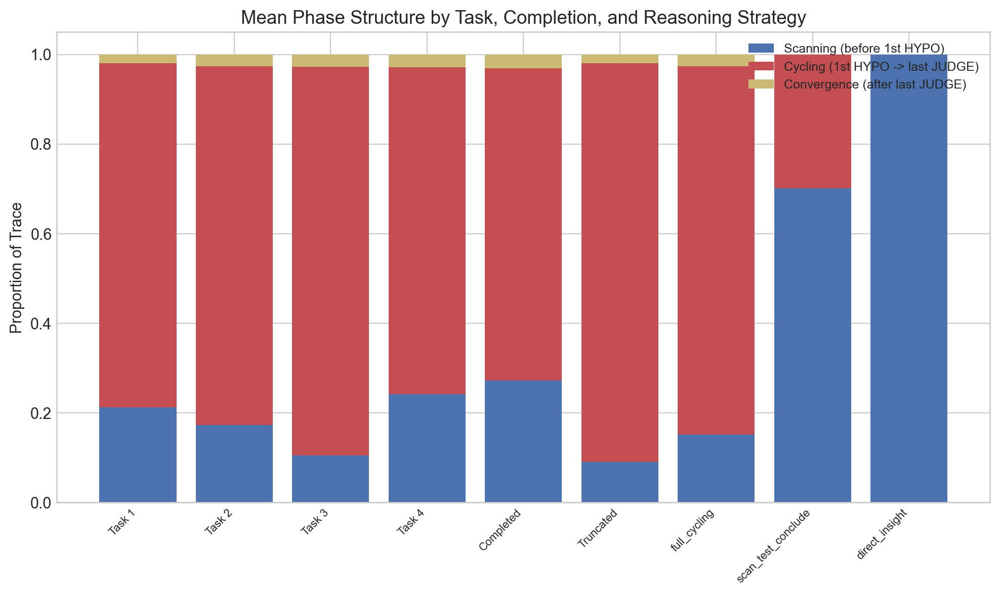

---

## 5. Dependency Architecture

### 5a. Dependency Coverage and Distance

98.7% of sentences have at least one dependency edge (`depends_on`). The primary exception is ORIENT (51.4% coverage), which typically has no antecedents. Mean dependencies per sentence is 2.19.

Dependency distances (gap in sentence IDs between a sentence and its dependency) vary by category: HYPO shows the longest mean distance (27.6 sentences), reflecting hypotheses that reference earlier scanning or prior cycles. TEST and JUDGE have shorter mean distances (2.8 and 3.0), as they typically reference nearby sentences within the current hypothesis cycle.

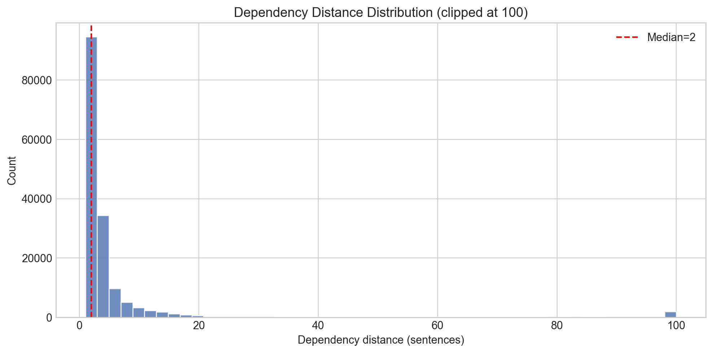

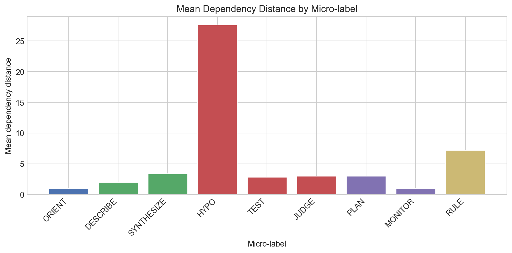

### 5b. Degree Analysis by Category

In-degree (how often a sentence is referenced) and out-degree (how many dependencies a sentence declares) reveal the informational roles of each category:

- **SYNTHESIZE** has the highest mean in-degree (3.447), meaning sentences of this type are most frequently referenced by downstream reasoning.
- **HYPO** has the highest mean out-degree (4.234), meaning sentences of this type declare the most dependencies.
- **RULE** shows high in-degree (1.945) but near-zero out-degree (0.027), consistent with its role as a terminal conclusion that references prior reasoning but is rarely referenced itself.
- **ORIENT** has low in-degree (0.519), confirming that opening sentences are rarely relevant to downstream hypothesis testing.

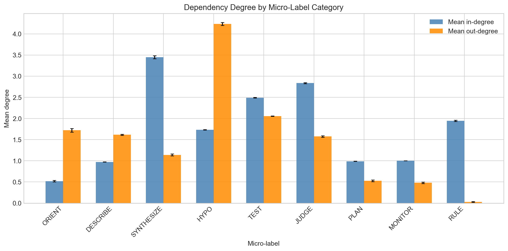

### 5c. Graph-Level Statistics

Per-trace dependency graphs have a mean density of **0.0141** (SD = 0.0136), confirming sparse connectivity dominated by local edges. The mean longest directed path is **127.4** sentences (SD = 82.2), and traces have a mean of **2.6** weakly connected components (median 2).

Graph density varies significantly by task (Kruskal-Wallis H = 30.797, p < 0.001). Completed traces have higher density (M = 0.0202) than truncated traces (M = 0.0078), reflecting their shorter length and tighter dependency structure.

Longest directed path differs significantly by completion status (Mann-Whitney U = 3,421.5, p < 0.001): truncated traces have longer critical paths (M = 175.4) than completed traces (M = 81.1). This reflects trace length: truncated traces tend to be longer (more sentences before hitting the token limit), producing longer dependency chains without converging.

Only 1 out of 320 traces contained a cyclic dependency graph (an auto-coding artefact), handled by computing longest path on the graph's DAG condensation.

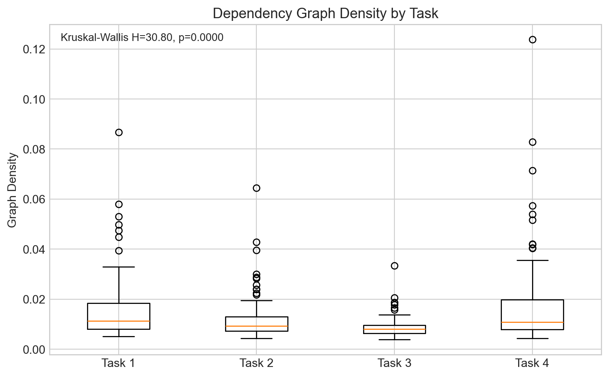

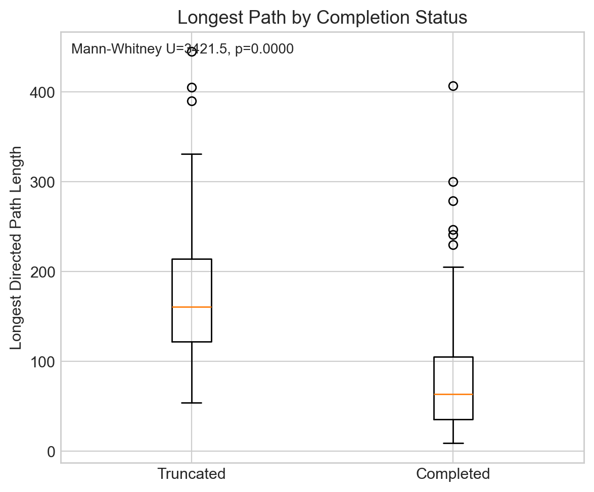

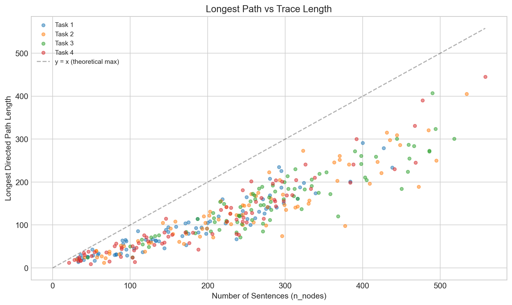

---

## 6. Hypothesis Dynamics

### 6a. Hypothesis Cycles

Hypothesis cycles (HYPO->TEST*->JUDGE sequences identified via the dependency graph) are the fundamental unit of hypothesis-testing activity. The corpus contains **7,027 cycles** across 320 traces, with a mean of **23.2 cycles per trace** and a mean cycle length of **5.1 sentences**. The cycle completion rate (proportion of HYPOs that reach a dependency-linked JUDGE) is **54.8%**, meaning roughly half of hypotheses are abandoned before a formal verdict.

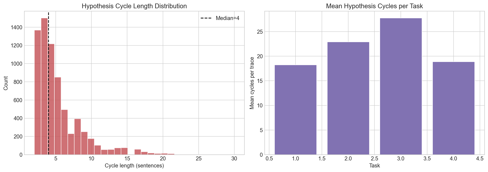

### 6b. Hypothesis Recycling and Perseveration

Hypothesis status (computed post-hoc from semantic similarity) reveals that only **25.2%** of hypotheses are genuinely novel. The majority are either **revised** (45.6%, modified from a prior hypothesis) or **repeated** (29.1%, restated without meaningful change). This recycling is pervasive across all four tasks.

**45.6%** of traces are classified as **perseverative** (containing at least one repetition chain of length >= 5), indicating that nearly half of all traces include extended sequences where the model restates the same hypothesis multiple times without productive revision.

Critically, **82.2%** of final rules in completed traces derive from revised or repeated hypotheses rather than novel ones. This suggests that hypothesis recycling is not purely pathological — it may serve a consolidation function, with the model progressively refining its answer through iterative restatement.

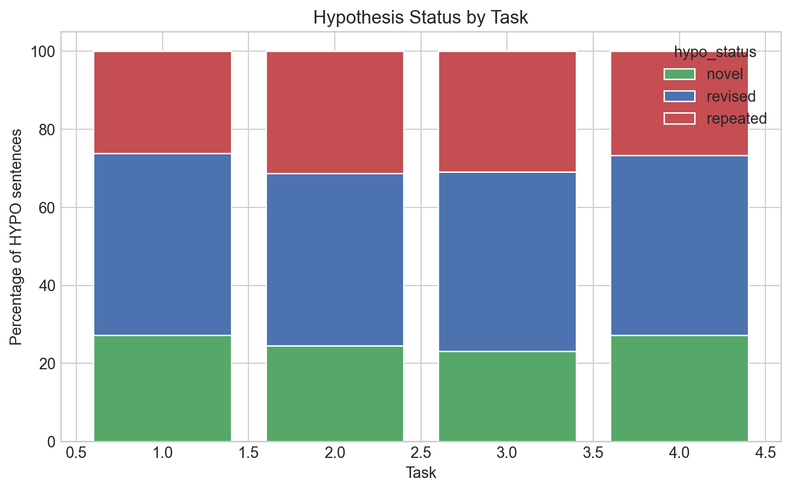

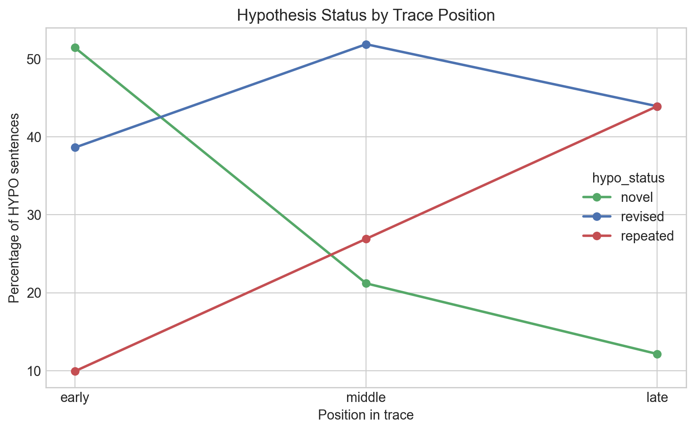

---

## 7. Summary of Key Findings

1. **TEST dominates the reasoning corpus** at 50.2% of sentences, with the INVESTIGATE macro-category (HYPO + TEST + JUDGE) accounting for 80.0% overall. Visual inductive reasoning is fundamentally an evidence-extraction task.

2. **Coding reliability is strong** (mean kappa = 0.829 micro, 0.830 macro), with 8/9 categories passing the >= 0.50 gate. SYNTHESIZE is the only weak category.

3. **The HYPO->TEST->JUDGE->HYPO cycle** is the dominant sequential motif, visible in both the transition matrix and the dependency graph structure. Traces contain a mean of 23.2 such cycles.

4. **Completed traces show more diverse reasoning** (higher transition entropy, M = 3.571 vs 3.337 for truncated, p < 0.001) and tighter dependency structure (higher graph density, shorter longest paths).

5. **Hypothesis recycling is pervasive**: only 25.2% of hypotheses are novel, 45.6% of traces are perseverative, yet 82.2% of final rules derive from recycled hypotheses.

6. **Phase structure is dominated by cycling** (79.2% of trace length), with brief scanning (18.3%) and minimal convergence (2.5%). Three reasoning strategies emerge: full_cycling (303), scan_test_conclude (14), and direct_insight (3).

7. **Dependency graphs are sparse but structured**: mean density 0.0141, with SYNTHESIZE showing the highest in-degree (most referenced) and HYPO the highest out-degree (most dependencies declared).

8. **Domain comparison with Bogdan et al.** shows Zendo reasoning is more evidence-extraction-heavy (50.2% vs 32.7% active_computation) and more hypothesis-driven (21.5% vs 15.5% plan_generation) than math problem-solving. Uncertainty-related categories are comparable (13.6% vs 18.5%).

9. **Task 3 (conjunctive rules)** shows the most stereotyped reasoning (lowest transition entropy) and longest cycling phase, consistent with its higher complexity.

10. **Cycle completion rate is moderate** (54.8%): roughly half of hypotheses are abandoned before reaching a JUDGE verdict, suggesting that the model frequently shifts strategy mid-evaluation.

---

## 8. Implications for Study 2 (Mechanistic Verification)

The corpus characterisation identifies several targets for mechanistic probing in Study 2:

- **TEST as primary probe target.** TEST's dominance (50.2% of corpus) makes it the richest source of activation data for training linear probes. The category's high self-transition rate (0.692) and moderate dependency distances suggest that TEST activations should show stable, locally coherent patterns.

- **HYPO->TEST->JUDGE as a sequential signature.** The dominant hypothesis-testing cycle should produce detectable activation trajectories. Probes trained on transition points (HYPO->TEST, TEST->JUDGE) may reveal how the model internally represents the shift from hypothesis generation to evidence evaluation to verdict.

- **MONITOR as phase transition marker.** MONITOR sentences (2.3% of corpus) mark moments of meta-cognitive reflection. Their position at cycling-phase boundaries makes them candidates for steering vector extraction — if MONITOR has a mechanistic signature, steering toward it could modulate the model's tendency to reflect vs perseverate.

- **Perseveration as a mechanistic target.** 45.6% of traces are perseverative. If "stuck" traces are mechanistically distinguishable from productive exploration (e.g., different activation trajectories during repeated vs revised hypotheses), this would provide evidence for faithfulness — the model's internal state reflects whether its reasoning is productive.

- **Reasoning strategy as a grouping variable.** The three reasoning strategies (full_cycling, scan_test_conclude, direct_insight) provide a natural grouping for Study 2 analyses — mechanistic signatures may differ across strategies.

- **The SYNTHESIZE reliability concern.** SYNTHESIZE's low validation kappa means probe training data for this category may contain noise. Analyses involving SYNTHESIZE should include sensitivity checks or consider merging with DESCRIBE at the macro level.

- **Graph structure as a probe feature.** Graph density and longest-path length characterise traces at the structural level. If activation patterns correlate with these graph features (e.g., denser graphs produce more coherent activation trajectories), this would link sequential reasoning structure to the model's internal representations.

---

*Report compiled by `notebooks/study1_04_report.ipynb` from outputs of Phase 4 analysis notebooks.*
